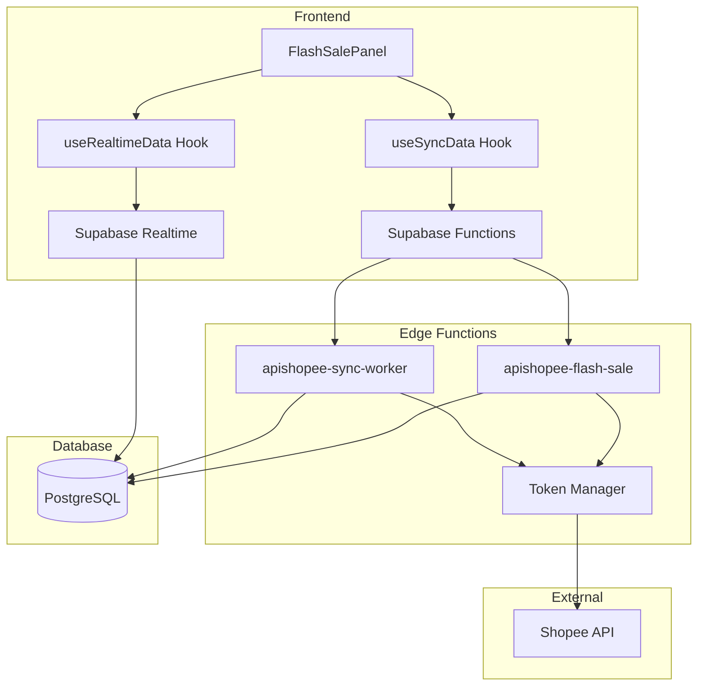

# Design Document: Flash Sale

## Overview

Hệ thống Flash Sale cho phép quản lý các chương trình khuyến mãi Flash Sale trên Shopee. Kiến trúc bao gồm:

- **Frontend**: React components với Supabase Realtime subscription
- **Backend**: Supabase Edge Functions gọi Shopee Partner API
- **Database**: PostgreSQL tables cho data storage và sync status

```
┌─────────────────────────────────────────────────────────────────────────────┐
│                              FRONTEND (React)                                │
│  ┌─────────────────┐    ┌─────────────────┐    ┌─────────────────────────┐  │
│  │ FlashSalePanel  │    │   useSyncData   │    │   useRealtimeData       │  │
│  │ (UI Component)  │───▶│   (Sync Hook)   │    │   (Realtime Hook)       │  │
│  └─────────────────┘    └────────┬────────┘    └───────────┬─────────────┘  │
└──────────────────────────────────┼─────────────────────────┼────────────────┘
                                   │                         │
                                   ▼                         ▼
┌─────────────────────────────────────────────────────────────────────────────┐
│                         SUPABASE EDGE FUNCTIONS                              │
│  ┌─────────────────────────┐    ┌─────────────────────────────────────────┐ │
│  │ apishopee-sync-worker   │    │       apishopee-flash-sale              │ │
│  │   (Background Sync)     │    │         (Direct Actions)                │ │
│  └───────────┬─────────────┘    └──────────────────┬──────────────────────┘ │
└──────────────┼─────────────────────────────────────┼────────────────────────┘
               │                                     │
               ▼                                     ▼
┌─────────────────────────────────────────────────────────────────────────────┐
│                            SHOPEE PARTNER API                                │
│  /api/v2/shop_flash_sale/*                                                  │
└─────────────────────────────────────────────────────────────────────────────┘
```

## Architecture

### Component Architecture



### Data Flow

1. **Sync Flow**: User triggers sync → Edge Function fetches from Shopee → Data stored in DB → Realtime updates UI
2. **Action Flow**: User performs action → Edge Function calls Shopee API → Response returned → UI updated
3. **Realtime Flow**: DB changes → Supabase Realtime → Hook refetches → UI re-renders

## Components and Interfaces

### 1. FlashSalePanel Component

```typescript
interface FlashSalePanelProps {
  shopId: number;
  userId: string;
}

interface FlashSalePanelState {
  filterType: '0' | '1' | '2' | '3';  // 0=all, 1=upcoming, 2=ongoing, 3=expired
  currentPage: number;
  itemsPerPage: number;  // default: 20
  selectedSale: FlashSale | null;
}
```

### 2. useSyncData Hook

```typescript
interface UseSyncDataOptions {
  shopId: number;
  userId: string;
  autoSyncOnMount?: boolean;
  syncType: 'flash_sales' | 'campaigns';
  staleMinutes?: number;  // default: 5
}

interface UseSyncDataReturn {
  isSyncing: boolean;
  lastSyncedAt: string | null;
  lastError: string | null;
  isStale: boolean;
  triggerSync: () => Promise<void>;
  syncStatus: SyncStatus | null;
}
```

### 3. useRealtimeData Hook

```typescript
interface UseRealtimeDataOptions<T> {
  tableName: string;
  shopId: number;
  userId: string;
  orderBy?: string;
  orderAsc?: boolean;
}

interface UseRealtimeDataReturn<T> {
  data: T[];
  loading: boolean;
  error: string | null;
  refetch: () => Promise<void>;
}
```

### 4. Edge Function: apishopee-flash-sale

```typescript
interface FlashSaleRequest {
  action: FlashSaleAction;
  shop_id: number;
  user_id?: string;
  flash_sale_id?: number;
  timeslot_id?: number;
  start_time?: number;
  end_time?: number;
  items?: FlashSaleItem[];
  item_id?: number;
}

type FlashSaleAction = 
  | 'get-time-slots'
  | 'create-flash-sale'
  | 'get-flash-sale'
  | 'get-flash-sale-list'
  | 'update-flash-sale'
  | 'delete-flash-sale'
  | 'add-items'
  | 'get-items'
  | 'update-items'
  | 'delete-items'
  | 'get-criteria';
```

### 5. Edge Function: apishopee-sync-worker

```typescript
interface SyncWorkerRequest {
  action: 'sync-flash-sale-data';
  shop_id: number;
  user_id: string;
}

interface SyncWorkerResponse {
  success: boolean;
  synced_count?: number;
  error?: string;
  synced_at?: string;
}
```

## Data Models

### FlashSale

```typescript
interface FlashSale {
  id: string;                    // UUID
  shop_id: number;
  user_id: string;
  flash_sale_id: number;
  timeslot_id: number;
  status: FlashSaleStatus;       // 0=deleted, 1=enabled, 2=disabled, 3=rejected
  start_time: number;            // Unix timestamp
  end_time: number;              // Unix timestamp
  enabled_item_count: number;
  item_count: number;
  type: FlashSaleType;           // 1=upcoming, 2=ongoing, 3=expired
  remindme_count: number;
  click_count: number;
  raw_response: object;
  synced_at: string;             // ISO timestamp
}

type FlashSaleStatus = 0 | 1 | 2 | 3;
type FlashSaleType = 1 | 2 | 3;
```

### FlashSaleItem

```typescript
interface FlashSaleItem {
  item_id: number;
  purchase_limit: number;        // 0 = unlimited
  // For items with variants
  models?: FlashSaleItemModel[];
  // For items without variants
  item_input_promo_price?: number;
  item_stock?: number;
}

interface FlashSaleItemModel {
  model_id: number;
  input_promo_price: number;     // Price before tax
  stock: number;                 // Campaign stock
}
```

### SyncStatus

```typescript
interface SyncStatus {
  id: string;
  shop_id: number;
  user_id: string;
  campaigns_synced_at: string | null;
  flash_sales_synced_at: string | null;
  is_syncing: boolean;
  last_sync_error: string | null;
  sync_progress: SyncProgress | null;
  updated_at: string;
}

interface SyncProgress {
  current_step: string;
  total_items: number;
  processed_items: number;
}
```

### TimeSlot

```typescript
interface TimeSlot {
  timeslot_id: number;
  start_time: number;            // Unix timestamp
  end_time: number;              // Unix timestamp
}
```

### UI Constants

```typescript
const STATUS_COLORS: Record<FlashSaleStatus, string> = {
  0: 'gray',      // Deleted
  1: 'green',     // Enabled
  2: 'yellow',    // Disabled
  3: 'red',       // Rejected
};

const TYPE_ICONS: Record<FlashSaleType, string> = {
  1: '⏳',        // Upcoming
  2: '🔥',        // Ongoing
  3: '✓',         // Expired
};

const TYPE_PRIORITY: Record<FlashSaleType, number> = {
  2: 1,           // Ongoing - highest
  1: 2,           // Upcoming
  3: 3,           // Expired - lowest
};

const STALE_MINUTES = 5;
const ITEMS_PER_PAGE = 20;
const TOKEN_BUFFER_MS = 5 * 60 * 1000;  // 5 minutes
```

## Correctness Properties

*A property is a characteristic or behavior that should hold true across all valid executions of a system-essentially, a formal statement about what the system should do. Properties serve as the bridge between human-readable specifications and machine-verifiable correctness guarantees.*

### Property 1: Sync Data Integrity

*For any* valid Shopee API response containing Flash Sale data, after sync completes, the database SHALL contain exactly the same Flash Sales with matching fields (flash_sale_id, status, start_time, end_time, type, item_count), and the sync_status table SHALL have updated flash_sales_synced_at timestamp.

**Validates: Requirements 1.2, 1.3, 1.4**

### Property 2: Staleness Detection

*For any* timestamp representing last sync time, the staleness detection function SHALL return true if and only if the difference between current time and last sync time exceeds STALE_MINUTES (5 minutes).

**Validates: Requirements 1.6**

### Property 3: Filter Logic Correctness

*For any* list of Flash Sales and filter type value (0, 1, 2, or 3), the filtered result SHALL contain only Flash Sales where type matches the filter (or all Flash Sales if filter is 0).

**Validates: Requirements 2.3**

### Property 4: Sort Priority Correctness

*For any* list of Flash Sales after sorting, Flash Sales with type=2 (Ongoing) SHALL appear before type=1 (Upcoming), which SHALL appear before type=3 (Expired).

**Validates: Requirements 2.4**

### Property 5: Pagination Correctness

*For any* list of N Flash Sales and page number P with items per page K, the paginated result SHALL contain at most K items starting from index (P-1)*K, and total pages SHALL equal ceil(N/K).

**Validates: Requirements 2.5**

### Property 6: UI Status and Type Mapping

*For any* Flash Sale status code (0, 1, 2, 3), the status color mapping SHALL return the correct color (gray, green, yellow, red respectively). *For any* Flash Sale type code (1, 2, 3), the type icon mapping SHALL return the correct icon (⏳, 🔥, ✓ respectively).

**Validates: Requirements 2.6, 2.7**

### Property 7: Time Slot Response Structure

*For any* valid time slot response from Shopee API, each time slot object SHALL contain timeslot_id (number), start_time (number), and end_time (number) fields.

**Validates: Requirements 3.4**

### Property 8: Flash Sale Creation Response

*For any* successful Flash Sale creation, the response SHALL contain flash_sale_id (number) and status (number, default 2).

**Validates: Requirements 4.2**

### Property 9: Deletion Type Validation

*For any* Flash Sale deletion request, the system SHALL allow deletion only if the Flash Sale type equals 1 (Upcoming). Deletion attempts on type 2 (Ongoing) or type 3 (Expired) SHALL be rejected with an error.

**Validates: Requirements 7.3**

### Property 10: Item Request Structure Validation

*For any* Flash Sale item with variants, the request structure SHALL contain item_id, purchase_limit, and models array where each model has model_id, input_promo_price, and stock. *For any* Flash Sale item without variants, the request structure SHALL contain item_id, purchase_limit, item_input_promo_price, and item_stock.

**Validates: Requirements 8.2, 8.3**

### Property 11: Token Refresh Round Trip

*For any* access token that is expired or expiring within TOKEN_BUFFER_MS (5 minutes), the Token Manager SHALL trigger refresh. After successful refresh, the new token SHALL be saved to database with updated access_token, refresh_token, expired_at, and token_updated_at fields. If an API call fails with auth error, the system SHALL refresh token and retry exactly once.

**Validates: Requirements 10.1, 10.2, 10.3, 10.4**

### Property 12: Error Response Format

*For any* Shopee API error, the system SHALL return HTTP 200 with error details in response body. *For any* known error code (shop_flash_sale_already_exist, shop_flash_sale.not_meet_shop_criteria, etc.), the system SHALL map it to a user-friendly error message.

**Validates: Requirements 12.1, 12.2, 12.3**

## Error Handling

### Error Code Mapping

```typescript
const ERROR_MESSAGES: Record<string, string> = {
  'shop_flash_sale_already_exist': 'Flash Sale đã tồn tại cho khung giờ này. Vui lòng chọn khung giờ khác.',
  'shop_flash_sale.not_meet_shop_criteria': 'Shop không đủ điều kiện tham gia Flash Sale. Kiểm tra rating và performance.',
  'shop_flash_sale_exceed_max_item_limit': 'Vượt quá giới hạn 50 sản phẩm. Vui lòng giảm số sản phẩm.',
  'shop_flash_sale_is_not_enabled_or_upcoming': 'Không thể sửa Flash Sale đang chạy hoặc đã kết thúc.',
  'shop_flash_sale_in_holiday_mode': 'Shop đang ở chế độ nghỉ. Vui lòng tắt holiday mode.',
  'error_auth': 'Token hết hạn. Đang tự động refresh...',
  'Invalid access_token': 'Token không hợp lệ. Đang tự động refresh...',
};
```

### Error Response Structure

```typescript
interface ErrorResponse {
  error: string;
  message?: string;
  success: false;
  details?: string;
}

// Edge Function always returns 200 to allow frontend to read error details
function createErrorResponse(error: Error): Response {
  return new Response(JSON.stringify({
    error: error.message,
    success: false,
    details: 'Check Supabase Edge Function logs for more details'
  }), {
    status: 200,
    headers: { ...corsHeaders, 'Content-Type': 'application/json' },
  });
}
```

### Token Refresh Error Handling

```typescript
async function handleTokenError(
  supabase: SupabaseClient,
  shopId: number,
  refreshToken: string,
  retryFn: () => Promise<unknown>
): Promise<unknown> {
  try {
    const newToken = await refreshAccessToken(refreshToken, shopId);
    await saveToken(supabase, shopId, newToken);
    return await retryFn();
  } catch (refreshError) {
    throw new Error('Token refresh failed. Please re-authenticate.');
  }
}
```

## Testing Strategy

### Unit Tests

Unit tests sẽ tập trung vào:
- Filter logic với các edge cases (empty list, single item, mixed types)
- Sort logic với các combinations của types
- Pagination với boundary conditions (first page, last page, empty)
- Status/Type mapping với all valid codes
- Staleness detection với various timestamps
- Error message mapping với known và unknown error codes

### Property-Based Tests

Property-based tests sẽ sử dụng **fast-check** library cho TypeScript:

```typescript
import * as fc from 'fast-check';

// Configuration: minimum 100 iterations per property
const PBT_CONFIG = { numRuns: 100 };
```

Mỗi property test sẽ:
1. Generate random valid inputs using fast-check arbitraries
2. Execute the function under test
3. Assert the property holds for all generated inputs
4. Tag với format: `Feature: flash-sale, Property N: [property_text]`

### Test File Structure

```
src/
├── lib/
│   └── shopee/
│       └── flash-sale/
│           ├── utils.ts              # Filter, sort, pagination, mapping functions
│           ├── utils.test.ts         # Unit tests
│           └── utils.property.test.ts # Property-based tests
├── hooks/
│   ├── useSyncData.ts
│   └── useSyncData.test.ts
supabase/
└── functions/
    ├── apishopee-flash-sale/
    │   └── index.ts
    └── apishopee-sync-worker/
        └── index.ts
```
