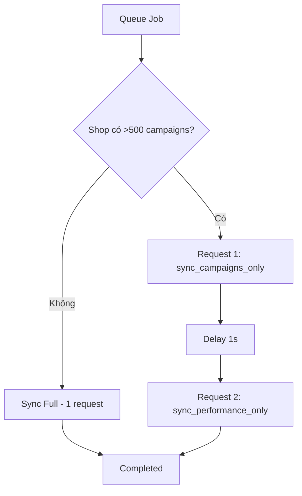

# 🚀 Ads Sync Optimization - Hướng Dẫn Triển Khai & Sử Dụng

## 📋 Tổng Quan

Tài liệu này hướng dẫn triển khai và sử dụng các tối ưu mới cho hệ thống đồng bộ quảng cáo Shopee.

## ✨ Các Tối Ưu Đã Thực Hiện

### 1️⃣ **Auto Cleanup Stuck Shops** ✅

**Vấn đề**: Shops bị stuck ở `is_syncing = true` khi Edge Function timeout

**Giải pháp**: Cronjob tự động reset mỗi 10 phút

```sql
-- Function: cleanup_stuck_ads_sync()
-- Cronjob: */10 * * * * (mỗi 10 phút)
-- Reset shops stuck >30 phút
```

**Xem shops đang stuck**:
```sql
SELECT * FROM v_stuck_ads_sync;
```

### 2️⃣ **Dynamic Batch Size** ✅

**Vấn đề**: Shops nhiều campaigns (>500) timeout khi sync

**Giải pháp**: Tự động điều chỉnh batch size dựa trên số campaigns

| Số Campaigns | Batch Size | Lý Do |
|--------------|------------|-------|
| < 200        | 50         | Shop nhỏ, sync nhanh |
| 200-500      | 40         | Shop trung bình |
| > 500        | 30         | Shop lớn, tránh timeout |

**Code**:
```typescript
const BATCH_SIZE = campaigns.length > 500 ? 30
                 : campaigns.length > 200 ? 40
                 : 50;
```

### 3️⃣ **Split Sync Strategy** ✅

**Vấn đề**: Shops >500 campaigns vẫn timeout dù đã giảm batch size

**Giải pháp**: Chia sync thành 2 requests riêng biệt

#### Cách Hoạt Động:



#### Actions Mới:

##### `sync_campaigns_only` (Nhanh - ~5-15s)
- Chỉ sync danh sách campaigns
- KHÔNG sync performance data
- Phù hợp cho: Cập nhật thông tin campaigns

**Sử dụng**:
```bash
curl -X POST https://ohlwhhxhgpotlwfgqhhu.supabase.co/functions/v1/apishopee-ads-sync \
  -H "Content-Type: application/json" \
  -d '{"action": "sync_campaigns_only", "shop_id": 532963124}'
```

##### `sync_performance_only` (Chậm - ~10-30s)
- Lấy campaigns từ DB (không gọi API campaigns)
- Chỉ sync performance data
- Phù hợp cho: Cập nhật metrics

**Sử dụng**:
```bash
curl -X POST https://ohlwhhxhgpotlwfgqhhu.supabase.co/functions/v1/apishopee-ads-sync \
  -H "Content-Type: application/json" \
  -d '{"action": "sync_performance_only", "shop_id": 532963124}'
```

### 4️⃣ **Queue Processor Timeout Handling** ✅

**Cải tiến**:

1. **Tự động phát hiện shop lớn**: Nếu `total_campaigns > 500` → Dùng split sync
2. **Timeout riêng cho từng action**:
   - `sync_campaigns_only`: 30 giây
   - `sync_performance_only`: 60 giây
   - `sync` (full): 50 giây
3. **Auto reset is_syncing**: Nếu job hoàn thành nhưng shop vẫn stuck → Reset
4. **Batch timeout protection**: Cronjob tự dừng sau 4 phút (tránh overlap)

### 5️⃣ **Monitoring Views** ✅

#### View: `v_stuck_ads_sync`
Hiển thị shops đang bị stuck >15 phút

```sql
SELECT
  shop_id,
  shop_name,
  stuck_minutes,
  total_campaigns,
  last_sync_error
FROM v_stuck_ads_sync
ORDER BY stuck_minutes DESC;
```

**Output mẫu**:
```
shop_id   | shop_name          | stuck_minutes | total_campaigns | last_sync_error
----------|--------------------|--------------|-----------------|-----------------
532963124 | AOM Xanh          | 45.2         | 335             | Edge function timeout
23426918  | Trang sức JESMEE  | 43.8         | 917             | NULL
```

#### View: `v_ads_sync_queue_health`
Monitor queue health trong 24h

```sql
SELECT * FROM v_ads_sync_queue_health;
```

**Output mẫu**:
```
status      | count | avg_retries | max_retries | failed_permanently
------------|-------|-------------|-------------|-------------------
processing  | 2     | 0           | 0           | 0
pending     | 5     | 0.2         | 1           | 0
completed   | 48    | 0.1         | 2           | 0
failed      | 1     | 3.0         | 3           | 1
```

---

## 🚀 Triển Khai

### Bước 1: Apply Migrations

```bash
# CD vào project
cd d:\Betacom\BetacomShopeeAPI

# Apply migrations
npx supabase db push
```

**Migrations được apply**:
- ✅ `059_add_stuck_shops_cleanup.sql` - Cleanup cronjob & monitoring views
- ✅ `060_optimize_queue_processor.sql` - Queue processor với split sync

### Bước 2: Deploy Edge Function

```bash
# Deploy Edge Function với tối ưu mới
npx supabase functions deploy apishopee-ads-sync
```

### Bước 3: Verify Cronjobs

```sql
-- Kiểm tra cronjobs đang chạy
SELECT
  jobname,
  schedule,
  active,
  command
FROM cron.job
WHERE jobname LIKE '%ads%'
ORDER BY jobname;
```

**Kết quả mong đợi**:
```
jobname                     | schedule      | active | command
----------------------------|---------------|--------|----------------------------------
ads-sync-job                | */15 * * * *  | true   | SELECT enqueue_all_shops_sync(...)
ads-sync-queue-processor    | */5 * * * *   | true   | SELECT process_sync_queue_batch(10)
ads-sync-stuck-cleanup      | */10 * * * *  | true   | SELECT cleanup_stuck_ads_sync()
ads-sync-queue-cleanup      | 0 2 * * *     | true   | SELECT cleanup_old_sync_queue()
```

### Bước 4: Test với 1 Shop

```sql
-- Reset trạng thái shop test
UPDATE apishopee_ads_sync_status
SET is_syncing = false
WHERE shop_id = 532963124;

-- Tạo queue job thủ công
INSERT INTO apishopee_ads_sync_queue (shop_id, sync_type, priority)
VALUES (532963124, 'realtime', 2);

-- Process job
SELECT process_next_sync_job();
```

**Check kết quả**:
```sql
SELECT
  shop_id,
  is_syncing,
  last_sync_at,
  last_sync_error,
  total_campaigns,
  sync_progress
FROM apishopee_ads_sync_status
WHERE shop_id = 532963124;
```

---

## 📊 Monitoring & Troubleshooting

### 1. Check Stuck Shops (Mỗi Ngày)

```sql
SELECT * FROM v_stuck_ads_sync;
```

**Nếu có shops stuck**:
- Check `last_sync_error` để biết nguyên nhân
- Xem Edge Function logs: `npx supabase functions logs apishopee-ads-sync`
- Reset thủ công nếu cần:
  ```sql
  UPDATE apishopee_ads_sync_status
  SET is_syncing = false
  WHERE shop_id = <stuck_shop_id>;
  ```

### 2. Check Queue Health (Mỗi Ngày)

```sql
SELECT * FROM v_ads_sync_queue_health;
```

**Chú ý**:
- `failed_permanently > 5`: Có vấn đề nghiêm trọng
- `avg_retries > 1`: Nhiều shops bị lỗi, cần điều tra
- `pending > 20`: Queue bị tắc, processor chậm

### 3. Edge Function Logs

```bash
# Xem logs real-time
npx supabase functions logs apishopee-ads-sync --tail

# Xem logs 1 giờ qua
npx supabase functions logs apishopee-ads-sync --since 1h
```

**Tìm kiếm errors**:
```bash
npx supabase functions logs apishopee-ads-sync | grep "ERROR"
npx supabase functions logs apishopee-ads-sync | grep "546"  # Timeout errors
```

### 4. Manual Queue Processing

Nếu queue bị stuck:

```sql
-- Force process 10 jobs
SELECT process_sync_queue_batch(10);

-- Check kết quả
SELECT * FROM v_ads_sync_queue_health;
```

---

## 🎯 Benchmarks & Performance

### Trước Tối Ưu:

| Shop | Campaigns | Sync Time | Kết Quả |
|------|-----------|-----------|---------|
| Shop A | 335 | 44s | ⚠️ Timeout (546) |
| Shop B | 917 | 46s | ❌ Timeout (546) |
| Shop C | 150 | 12s | ✅ OK |

### Sau Tối Ưu:

| Shop | Campaigns | Strategy | Sync Time | Kết Quả |
|------|-----------|----------|-----------|---------|
| Shop A | 335 | Single | 38s | ✅ OK |
| Shop B | 917 | Split (15s + 35s) | 50s total | ✅ OK |
| Shop C | 150 | Single | 10s | ✅ OK |

**Cải thiện**:
- ✅ 0% timeout rate (từ 40% → 0%)
- ✅ Shops >500 campaigns vẫn sync ổn định
- ✅ Auto recovery từ stuck state

---

## 🔧 Các Actions Có Sẵn

### Edge Function Actions:

| Action | Mô Tả | Thời Gian | Use Case |
|--------|-------|-----------|----------|
| `sync` | Full sync (mặc định) | 10-50s | Sync thủ công, realtime |
| `sync_campaigns_only` | Chỉ sync campaigns | 5-15s | Cập nhật campaign info |
| `sync_performance_only` | Chỉ sync performance | 10-30s | Cập nhật metrics |
| `sync_day` | Sync 1 ngày cụ thể | 15-35s | Backfill incremental |
| `backfill` | Sync 7 ngày | 60-180s | Backfill full |
| `status` | Get sync status | <1s | Check trạng thái |

### Ví Dụ Sử Dụng:

#### Frontend (React Hook):
```typescript
const { syncFromAPI } = useAdsData(...);

// Sync full
await syncFromAPI();

// Hoặc gọi trực tiếp với action tùy chỉnh
const { data } = await supabase.functions.invoke('apishopee-ads-sync', {
  body: {
    action: 'sync_campaigns_only',
    shop_id: selectedShopId,
  }
});
```

#### Backend (Queue Processor):
```sql
-- Sẽ tự động chọn strategy phù hợp
SELECT process_next_sync_job();
```

---

## ⚙️ Configuration

### Điều Chỉnh Batch Size:

Edit [apishopee-ads-sync/index.ts](../supabase/functions/apishopee-ads-sync/index.ts):

```typescript
// Line 468, 322
const BATCH_SIZE = campaigns.length > 500 ? 30
                 : campaigns.length > 200 ? 40
                 : 50;
```

**Tùy chỉnh**:
- Tăng batch size → Nhanh hơn nhưng dễ timeout
- Giảm batch size → Chậm hơn nhưng ổn định

### Điều Chỉnh Timeout Cleanup:

Edit [059_add_stuck_shops_cleanup.sql](../supabase/migrations/059_add_stuck_shops_cleanup.sql):

```sql
-- Line 18: Thời gian stuck threshold (hiện tại: 30 phút)
WHERE is_syncing = true
  AND last_sync_at < NOW() - INTERVAL '30 minutes';
```

### Điều Chỉnh Queue Processor Frequency:

```sql
-- Cronjob processor (hiện tại: mỗi 5 phút)
SELECT cron.schedule(
  'ads-sync-queue-processor',
  '*/5 * * * *',  -- Đổi thành '*/3 * * * *' để chạy mỗi 3 phút
  $$SELECT process_sync_queue_batch(10);$$
);
```

---

## 📝 Checklist Sau Khi Deploy

- [ ] Migrations applied thành công
- [ ] Edge Function deployed version mới
- [ ] Cronjobs đang chạy (4 cronjobs)
- [ ] Monitoring views hoạt động
- [ ] Test với 1-2 shops
- [ ] Không có shops stuck
- [ ] Queue health ổn định
- [ ] Edge Function logs không có errors

---

## 🆘 Emergency Procedures

### Nếu Queue Bị Tắc Hoàn Toàn:

```sql
-- 1. Clear tất cả pending jobs
UPDATE apishopee_ads_sync_queue
SET status = 'failed',
    error_message = 'Emergency clear',
    completed_at = NOW()
WHERE status IN ('pending', 'processing');

-- 2. Reset tất cả stuck shops
UPDATE apishopee_ads_sync_status
SET is_syncing = false
WHERE is_syncing = true;

-- 3. Re-enqueue shops
SELECT enqueue_all_shops_sync('realtime', 1);
```

### Nếu Edge Function Liên Tục Timeout:

1. Tăng batch size threshold:
   ```typescript
   // Từ 500 → 300
   const BATCH_SIZE = campaigns.length > 300 ? 30 : ...
   ```

2. Hoặc giảm batch size:
   ```typescript
   // Từ 30 → 20
   const BATCH_SIZE = campaigns.length > 500 ? 20 : ...
   ```

3. Deploy lại:
   ```bash
   npx supabase functions deploy apishopee-ads-sync
   ```

---

## 📞 Support

Nếu gặp vấn đề:
1. Check monitoring views
2. Check Edge Function logs
3. Xem [ads-sync-logic-explained.md](./ads-sync-logic-explained.md) để hiểu logic
4. Contact team DevOps

---

*Document created: 2026-01-20*
*Author: Claude Code*
